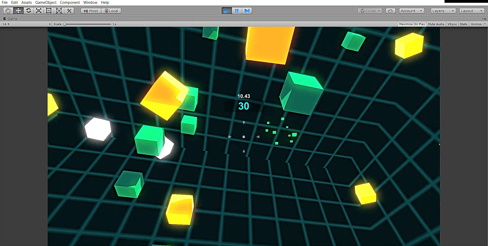
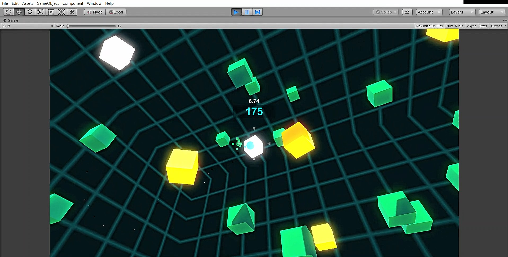
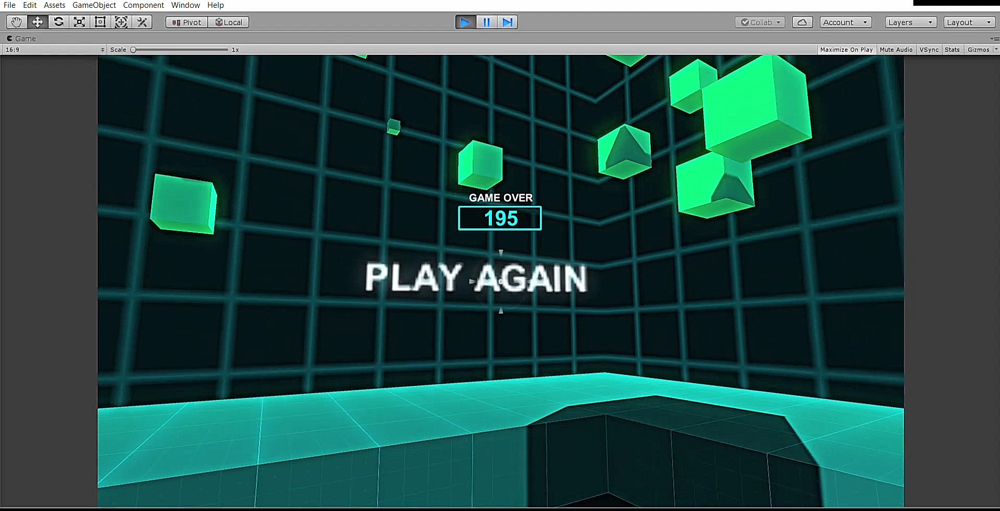

# Box Shooter Game In Unity 3D:

Shooter game created with Unity objects and particle system effects alone. The idea of game is simply to 
shoot green boxes for points, with bonus boxes to add more time and enemy boxes which lead to a loss in time.

Your aim is to earn points by shooting the boxes falling down from the sky using your mouse as you move on a 3D platform. There is a countdown timer, which ends the game when it hits zero. The boxes themselves are timed, which causes them to dissappear after some time if you don't shoot them fast enough. There are three kinds of boxes:

a regular blue box which gives points,
a red penalty box, and
a time box which extends the countdown timer.

The game is built on the Unity3D game engine, written in C# in Visual Studio.

Screenshots
-----------

